# Sky Printing 🖨️
## ✨ _Cloud based printing system_ ✨

> Sky printting is a cloud based printing system, that introduce feature like remote printing. Sky printing is Android, Windows, Linux based apps, that simplifying printing toruble.   


## Features
- Mobile and Desktop ready.
- Realtime : Realtime communication between mobile to printer with PC as middleman.
- Queued : Queued based to prevent race condition.
- Printing : Easily print documents both color and non-color (black and white). 
- Photo Printing : Conveniently print photos with various size.
- History : Track past printing activities.
- Profile : Manage personal information.
- Wallet (Payment) : Handle transactions effortlessly.

## Concept
This concept we've design early :


### Gantt chart

```mermaid
gantt
    title Sky Printing

    section Environment Setup
        Initialize Turborepo     :a1, 2023-01-01, 30d
        Setup API Workspace     :after a1  , 20d
        Setup Mobile Workspace  :after a1  , 20d
        Setup Desktop Workspace :after a1  , 20d
        Setup Shared Package    :after a1  , 20d

    section API
        Create Schema            :a2, 2023-02-01, 40d
            User                 :after a2, 10d
            Store                :after a2, 10d
            Printer              :after a2, 10d
            Bundle               :after a2, 10d
            Document             :after a2, 10d
            Order                :after a2, 10d
        Create Rest API Controller :after a2  , 20d
            User                 :after a2, 5d
            Store                :after a2, 5d
            Printer              :after a2, 5d
            Bundle               :after a2, 5d
            Document             :after a2, 5d
            Order                :after a2, 5d
        Create Seeder             :after a2  , 5d
        Create Types Validation   :after a2  , 10d
            User                 :after a2, 2d
            Store                :after a2, 2d
            Printer              :after a2, 2d
            Bundle               :after a2, 2d
            Document             :after a2, 2d
            Order                :after a2, 2d
        Optimize Auth with Middleware :after a2, 5d
        Create Sanitizer for Crucial Data :after a2, 5d
        Create Routing for Rest API :after a2, 5d
        Create WebSocket         :after a2, 5d
        Add Payment Gateway      :after a2, 5d

    section Create Core Package
        Create Entities          :a3, 2023-03-15, 40d
            User                 :after a3, 7d
            Store                :after a3, 7d
            Printer              :after a3, 7d
            Bundle               :after a3, 7d
            Document             :after a3, 7d
            Order                :after a3, 7d
        Create Models            :after a3  , 20d
            User                 :after a3, 5d
            Store                :after a3, 5d
            Printer              :after a3, 5d
            Bundle               :after a3, 5d
            Document             :after a3, 5d
            Order                :after a3, 5d
        Create Core Package       :after a3  , 30d
            Create Response Handler :after a3, 5d
            Create Common Utilities & Context Extension :after a3, 5d
            Create Network Adapter :after a3, 5d
            Create WebSocket Adapter :after a3, 5d
            Create Payment Gateway Adapter :after a3, 5d
            Create GPS Adapter   :after a3, 5d
            Create Localization  :after a3, 5d
        Create Abstraction Contract Repository :after a3, 15d
            Auth                 :after a3, 5d
            Store                :after a3, 5d
            Product              :after a3, 5d
            Location             :after a3, 5d
        Create Implementation of Contract Repository :after a3, 15d
            Auth                 :after a3, 5d
            Store                :after a3, 5d
            Product              :after a3, 5d
            Location             :after a3, 5d
        Create Data Source        :after a3  , 25d
            Remote               :after a3, 5d
            Auth                 :after a3, 5d
            Store                :after a3, 5d
            Local                :after a3, 5d
            GPS Location         :after a3, 5d
        Create Use Case           :after a3  , 40d
            Login                :after a3, 3d
            Register             :after a3, 3d
            Fetch User Data      :after a3, 3d
            Fetch Store          :after a3, 3d
            Fetch Store Products :after a3, 3d
            Post Order           :after a3, 3d
            Update Location      :after a3, 3d
            Connect Socket        :after a3, 3d
            Join Room (Store)    :after a3, 3d
            Send Socket Message  :after a3, 3d
            Retrieve Broadcast Message :after a3, 3d
        Local                    :after a3  , 5d
            Fetch GPS Location   :after a3, 5d

```

<details>
    <summary>Click to view</summary>



</details>

## Tech

Sky Printing uses a number of open source projects to work properly :

- [Dart](https://dart.dev/get-dart/) - Dart is a versatile, client-optimized programming language, developed by Google, known for building cross-platform mobile, web, and desktop applications.
- [TypeScript](https://www.npmjs.com/package/typescript) - TypeScript is a superset of JavaScript, offering static typing and enhanced tooling for building scalable and maintainable web applications.
- [C++](https://code.visualstudio.com/docs/languages/cpp) - C++ is a powerful, high-performance programming language widely used for system/application development, game development, and performance-critical applications.
- [CMake](https://cmake.org/cmake/help/latest/guide/tutorial/Installing%20and%20Testing.html) - CMake is a cross-platform build system generator, facilitating the management of the build process for software projects across various platforms and environments.

## Preview

<details>
    <summary>## Mobile User Interface 📱</summary>
- Landing Screen
 
- Login Screen

- Home Screen

- Print Screen

- Preview Screen

</details>

<details>
    <summary>## Desktop User Interface 💻</summary>
- Dashboard Screen

- Print Queue

</details>
## Installation 🚀
```
git clone https://github.com/zenta-dev/sky_printing.git
```
```
cd sky-printing
```
```
pnpm install
```
```
./install.bat
```

## Development 🛠️
Want to contribute? Great!

Sky Printing use Flutter and Express for rapid Development. 

#### API
[API](https://github.com/Zenta-Code/sky_printing/blob/main/apps/desktop/README.md)

#### Desktop
[Desktop](https://github.com/Zenta-Code/sky_printing/blob/main/apps/desktop/README.md)

#### Mobile
[Mobile](https://github.com/Zenta-Code/sky_printing/blob/main/apps/mobile/README.md)

## License

> Zenta-Dev (2023) 
