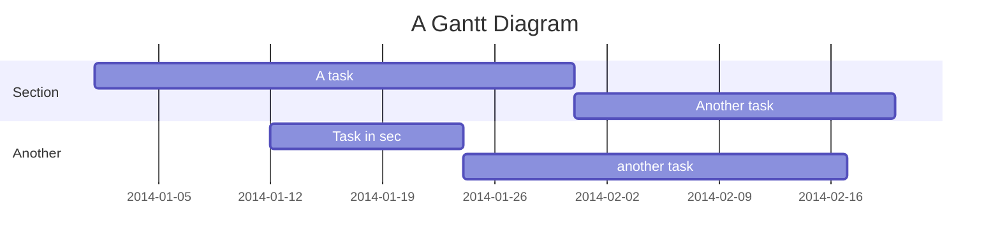

# Sky Printing

> Sky Printing is a cutting-edge mobile app that introduces an automatic printing system with features like printing, binding, and photo printing. This mobile app can simplifying employee tasks and it enhances store efficiency without the need for extra time and effort. Additionally, it provides remote accessibility with ensuring customer convenience in managing their printing needs effortlessly.

## Concepts

This concept we've design early :


## Features

- Printing : Easily print documents both color and non-color (black and white).
- Binding : Seamlessly bind materials.
- Photo Printing : Conveniently print photos with various size.
- History : Track past printing activities.
- EProfile : Manage personal information.
- Wallet (Payment) : Handle transactions effortlessly.

## Tech

Sky Printing uses a number of open source projects to work properly :

- [Dart](https://dart.dev/get-dart/) - Dart is a versatile, client-optimized programming language, developed by Google, known for building cross-platform mobile, web, and desktop applications.
- [TypeScript](https://www.npmjs.com/package/typescript) - TypeScript is a superset of JavaScript, offering static typing and enhanced tooling for building scalable and maintainable web applications.
- [C++](https://code.visualstudio.com/docs/languages/cpp) - C++ is a powerful, high-performance programming language widely used for system/application development, game development, and performance-critical applications.
- [CMake](https://cmake.org/cmake/help/latest/guide/tutorial/Installing%20and%20Testing.html) - CMake is a cross-platform build system generator, facilitating the management of the build process for software projects across various platforms and environments.

## Requirement

## User Interface

### Splash Screen


### Dashboard


### History


### Wallet


### EProfile


## Installation

To build all apps and packages, run the following command :

```
git clone https://github.com/Zenta-Code/printilan.git
```

```
cd my-turborepo
```

```
pnpm build
```

```
cd apps/mobile
```

```
flutter build apk
```

## Plugins

Sky Printing is currently extended with the following plugins. Instructions on how to use them in your own application are linked below.
| Plugin | README |
| ------ | ------ |
| Dropbox | [plugins/dropbox/README.md][PlDb] |
| GitHub | [plugins/github/README.md][PlGh] |
| Google Drive | [plugins/googledrive/README.md][PlGd] |
| OneDrive | [plugins/onedrive/README.md][PlOd] |
| Medium | [plugins/medium/README.md][PlMe] |
| Google Analytics | [plugins/googleanalytics/README.md][PlGa] |

## Development

To develop all apps and packages, read readme.md in each folder.

#### API

[API](https://github.com/Zenta-Code/sky_printing/blob/main/apps/desktop/README.md)

#### Desktop

[Desktop](https://github.com/Zenta-Code/sky_printing/blob/main/apps/desktop/README.md)

#### Mobile

[Mobile](https://github.com/Zenta-Code/sky_printing/blob/main/apps/mobile/README.md)

## License



> Zenta-Code (2023)
